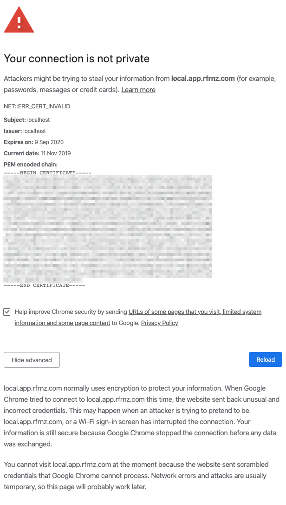
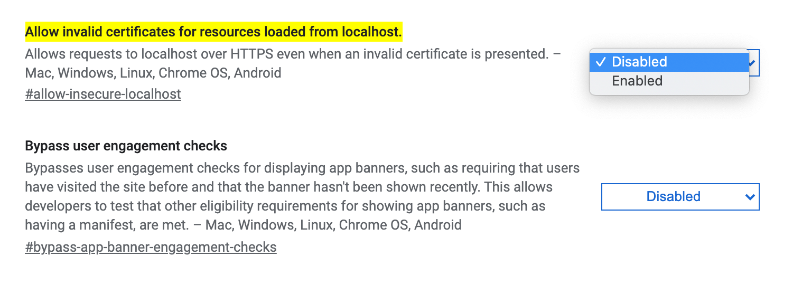
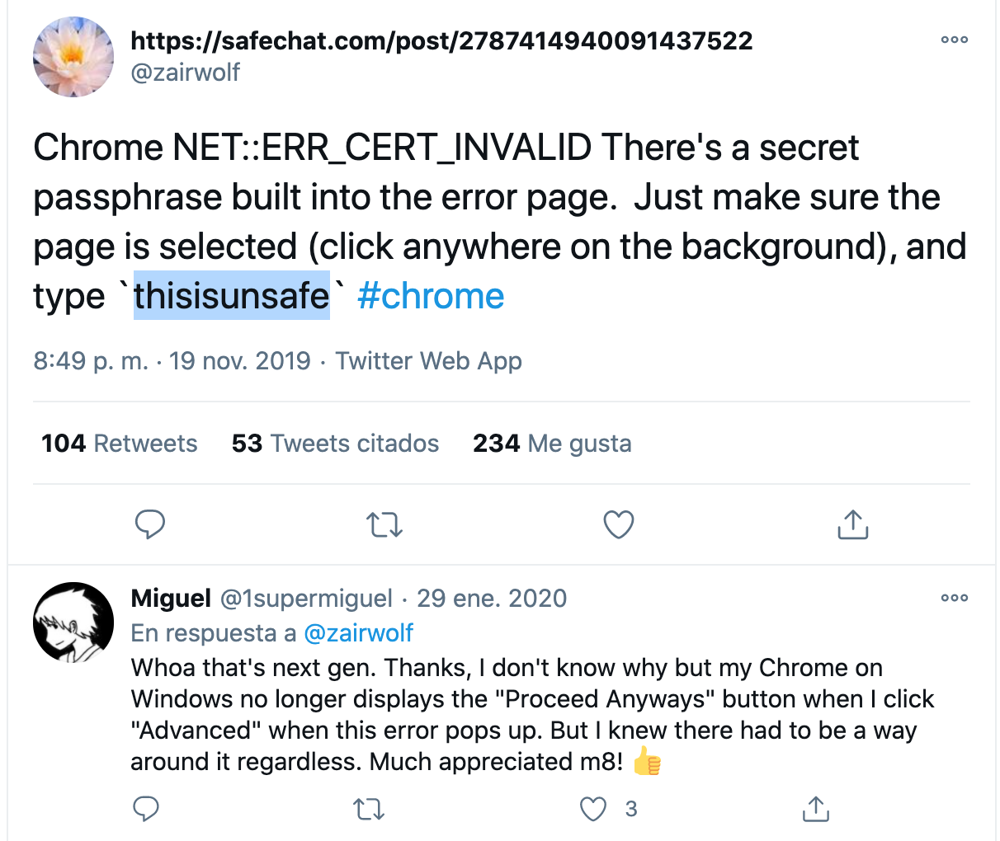

# Chrome

# Problems with the certificates.

You are get the following screen??

If web it's a local server you can try change the following flag in chrome

Copy and paste the following address and change from Disabled to Enabled

**chrome://flags/#allow-insecure-localhost**

When it's a remote server and use MacOs we don't have possibility of bypass, but...the people of Google they gave us an easter egg, it's write the following cheatcode in the screen:

**thisisunsafe**

[https://twitter.com/zairwolf/status/1196878125734486021](https://twitter.com/zairwolf/status/1196878125734486021)

---
<!-- Pit i Collons -->

